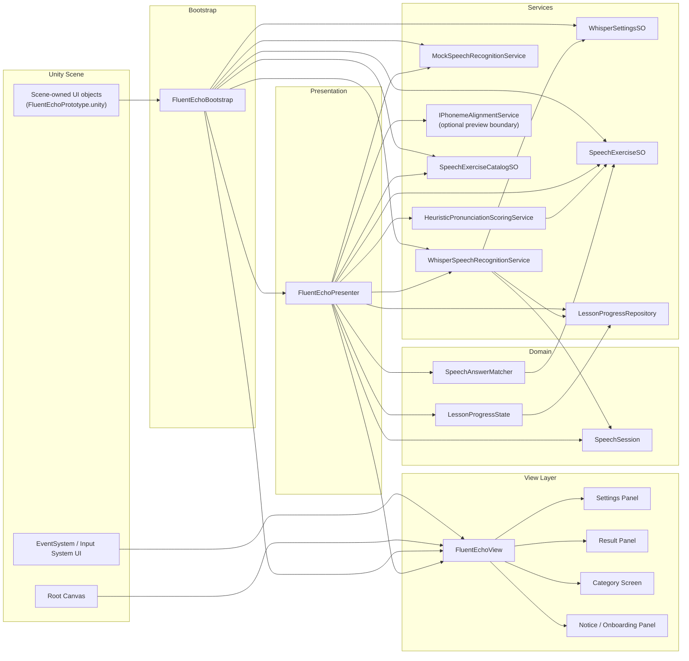

# Fluent Echo Dependency Map

This diagram shows the runtime dependency chain in the current prototype.
It is intentionally written as an engineering map, not a folder tree.

The main rule is simple:

- data defines what can be practiced;
- services do the work;
- presenter coordinates state and flow;
- view renders the experience;
- bootstrap wires the scene together.

## Runtime Map

## How To Read The Map

- `SpeechExerciseSO` defines a single practice item.
- `SpeechExerciseCatalogSO` groups those items into categories.
- `WhisperSpeechRecognitionService` produces local transcripts.
- `SpeechAnswerMatcher` decides whether the transcript matches the lesson target.
- `HeuristicPronunciationScoringService` turns the attempt into a transparent practice estimate.
- `FluentEchoPresenter` owns the app flow and decides what the user sees next.
- `FluentEchoView` only renders state and raises UI events.
- `FluentEchoBootstrap` is the composition root for the scene.

## What Is Intentionally Not In The Map

- no cloud speech API;
- no hidden global singleton service locator;
- no automatic scene rebuilding that overrides designer layout;
- no claim of true phoneme-level pronunciation assessment in the current shipped flow.

## Content Extension Rule

When you add new lessons or categories, keep the same chain:

`new ScriptableObject content -> catalog update -> scene UI exposure if needed -> presenter reuse`

That keeps the project readable and prevents content from leaking into the runtime architecture.

