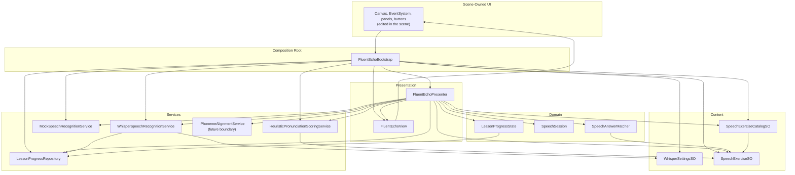

# Fluent Echo Dependency Map

This page shows the runtime dependency chain in the current prototype.
It is intentionally written as an engineering map, not a folder tree.

The short version is:

- scene-owned UI defines the layout;
- bootstrap wires the scene together;
- presenter owns flow and state;
- services do the work;
- data defines what can be practiced.

## Runtime Map

## Layer Guide

| Layer | What lives there | Why it matters |
| --- | --- | --- |
| Scene-Owned UI | Canvas, buttons, panels, anchors, layout | Designers can move and restyle it without rewriting code |
| Composition Root | `FluentEchoBootstrap` | Wires scene references and restores saved state |
| Presentation | `FluentEchoPresenter`, `FluentEchoView` | Owns flow, screens, and UI state changes |
| Domain | `SpeechAnswerMatcher`, `SpeechSession`, `LessonProgressState` | Keeps logic testable and independent from Unity UI |
| Services | Whisper, mock mode, heuristic scoring, persistence | Handles speech, scoring, and saved progress |
| Content | `SpeechExerciseSO`, `SpeechExerciseCatalogSO`, `WhisperSettingsSO` | Defines lessons, categories, and model/profile data |

## How To Read The Map

- `SpeechExerciseSO` defines a single practice item.
- `SpeechExerciseCatalogSO` groups those items into categories.
- `WhisperSpeechRecognitionService` produces local transcripts.
- `SpeechAnswerMatcher` decides whether the transcript matches the lesson target.
- `HeuristicPronunciationScoringService` turns the attempt into a transparent practice estimate.
- `FluentEchoPresenter` owns the app flow and decides what the user sees next.
- `FluentEchoView` only renders state and raises UI events.
- `FluentEchoBootstrap` is the composition root for the scene.

## What Is Intentionally Not In The Map

- no cloud speech API;
- no hidden global singleton service locator;
- no automatic scene rebuilding that overrides designer layout;
- no claim of true phoneme-level pronunciation assessment in the current shipped flow.

## Content Extension Rule

When you add new lessons or categories, keep the same chain:

`new ScriptableObject content -> catalog update -> scene UI exposure if needed -> presenter reuse`

That keeps the project readable and prevents content from leaking into the runtime architecture.
